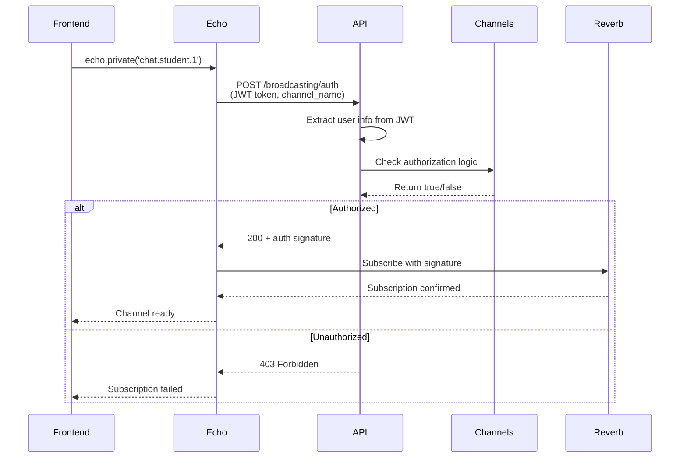
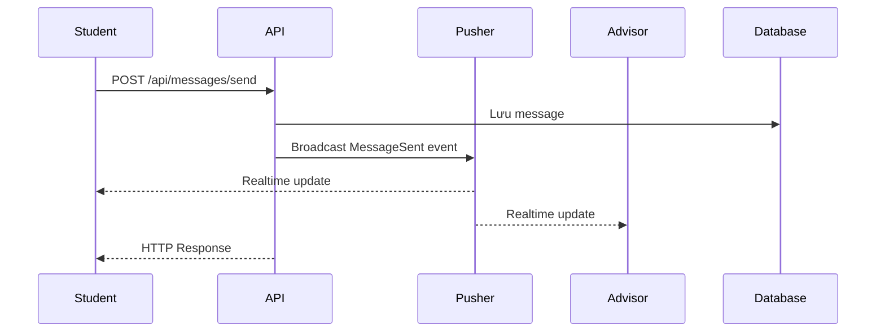

# API Documentation - Dialog Controller

## Base URL

```
/api/dialogs
```

## Authorization

-   **Header**: `Authorization: Bearer {token}`
-   **Roles**: `student`, `advisor`
-   **Auto-detect**: Backend tự động xác định student_id/advisor_id từ token

---

## 1. Get Conversations List

### Endpoint

```http
GET /api/dialogs/conversations
```

### Description

Lấy danh sách cuộc hội thoại. Backend tự động xác định dựa trên role trong token.

### Access Control

-   **Student**: Xem hội thoại với cố vấn của lớp mình
-   **Advisor**: Xem hội thoại với tất cả sinh viên trong các lớp mình phụ trách

### Response (Student)

```json
{
    "success": true,
    "data": [
        {
            "conversation_id": 1,
            "partner_id": 1,
            "partner_name": "ThS. Trần Văn An",
            "partner_avatar": "https://example.com/avatar.jpg",
            "partner_type": "advisor",
            "last_message": "Chào Hùng, em chuẩn bị tốt cho kỳ thi nhé",
            "last_message_time": "2025-11-14T15:30:00.000000Z",
            "has_attachment": false,
            "unread_count": 2
        }
    ],
    "message": "Lấy danh sách hội thoại thành công"
}
```

### Response (Advisor)

```json
{
    "success": true,
    "data": [
        {
            "conversation_id": 1,
            "partner_id": 1,
            "partner_code": "210001",
            "partner_name": "Nguyễn Văn Hùng",
            "partner_avatar": null,
            "partner_type": "student",
            "class_name": "DH21CNTT",
            "last_message": "Dạ em cảm ơn thầy",
            "last_message_time": "2025-11-14T16:00:00.000000Z",
            "has_attachment": false,
            "unread_count": 1
        },
        {
            "conversation_id": 2,
            "partner_id": 2,
            "partner_code": "210002",
            "partner_name": "Trần Thị Thu Cẩm",
            "partner_avatar": null,
            "partner_type": "student",
            "class_name": "DH21CNTT",
            "last_message": "Thầy ơi, em bị cảnh cáo học vụ HK1...",
            "last_message_time": "2025-11-13T10:00:00.000000Z",
            "has_attachment": true,
            "unread_count": 0
        }
    ],
    "message": "Lấy danh sách hội thoại thành công"
}
```

### Response Fields

| Field             | Type          | Description                                        |
| ----------------- | ------------- | -------------------------------------------------- |
| conversation_id   | integer       | ID cuộc hội thoại = partner_id                     |
| partner_id        | integer       | ID người đối thoại (advisor_id hoặc student_id)    |
| partner_name      | string        | Tên người đối thoại                                |
| partner_avatar    | string/null   | Avatar người đối thoại                             |
| partner_type      | string        | "advisor" hoặc "student"                           |
| partner_code      | string        | Mã sinh viên (chỉ có khi partner_type = "student") |
| class_name        | string        | Tên lớp (chỉ có khi partner_type = "student")      |
| last_message      | string/null   | Nội dung tin nhắn cuối                             |
| last_message_time | datetime/null | Thời gian tin nhắn cuối                            |
| has_attachment    | boolean       | Tin nhắn cuối có file đính kèm hay không           |
| unread_count      | integer       | Số tin nhắn chưa đọc                               |

### Error Responses

-   **404 Not Found** (Student without advisor):

```json
{
    "success": false,
    "message": "Lớp của bạn chưa có cố vấn"
}
```

### Example

```bash
curl -X GET "http://localhost:8000/api/dialogs/conversations" \
  -H "Authorization: Bearer {token}"
```

```javascript
// Frontend example
const response = await fetch("/api/dialogs/conversations", {
    headers: {
        Authorization: `Bearer ${token}`,
    },
});
const data = await response.json();
```

---

## 2. Get Messages in Conversation

### Endpoint

```http
GET /api/dialogs/messages
```

### Query Parameters

| Parameter  | Type    | Required | Description                                     |
| ---------- | ------- | -------- | ----------------------------------------------- |
| partner_id | integer | Yes      | ID người đối thoại (advisor_id hoặc student_id) |

### Description

Lấy lịch sử tin nhắn với một người cụ thể. Backend tự động xác định student_id/advisor_id dựa vào role.

### Access Control

-   **Student**: Chỉ xem tin nhắn với cố vấn lớp mình (partner_id = advisor_id)
-   **Advisor**: Chỉ xem tin nhắn với sinh viên trong lớp mình (partner_id = student_id)

### ⚠️ Important: Auto Mark as Read

**API này không chỉ lấy tin nhắn mà còn tự động cập nhật trạng thái đã đọc:**

-   Khi **student** gọi API: Tất cả tin nhắn từ **advisor** gửi cho student (và có `is_read = 0`) sẽ được đánh dấu `is_read = 1`
-   Khi **advisor** gọi API: Tất cả tin nhắn từ **student** gửi cho advisor (và có `is_read = 0`) sẽ được đánh dấu `is_read = 1`

**Lưu ý:** Tin nhắn do chính mình gửi sẽ KHÔNG bị cập nhật trạng thái.

### Response

```json
{
    "success": true,
    "data": [
        {
            "message_id": 1,
            "student_id": 2,
            "advisor_id": 1,
            "sender_type": "student",
            "content": "Thầy ơi, em bị cảnh cáo học vụ HK1, giờ em phải làm sao ạ?",
            "attachment_path": null,
            "attachment_url": null,
            "is_read": true,
            "sent_at": "2025-03-11T09:00:00.000000Z"
        },
        {
            "message_id": 2,
            "student_id": 2,
            "advisor_id": 1,
            "sender_type": "advisor",
            "content": "Chào Cẩm, em cần đăng ký học lại ngay môn IT001 trong HK2 này nhé.",
            "attachment_path": "message_attachments/1733123456_abc123_document.pdf",
            "attachment_url": "http://localhost:8000/storage/message_attachments/1733123456_abc123_document.pdf",
            "is_read": true,
            "sent_at": "2025-03-11T09:05:00.000000Z"
        },
        {
            "message_id": 3,
            "student_id": 2,
            "advisor_id": 1,
            "sender_type": "student",
            "content": "Dạ em đăng ký học lại rồi ạ. Em cảm ơn thầy.",
            "attachment_path": null,
            "attachment_url": null,
            "is_read": true,
            "sent_at": "2025-03-11T09:10:00.000000Z"
        }
    ],
    "message": "Lấy tin nhắn thành công"
}
```

### Response Fields

| Field           | Type        | Description                                     |
| --------------- | ----------- | ----------------------------------------------- |
| message_id      | integer     | ID tin nhắn                                     |
| student_id      | integer     | ID sinh viên trong hội thoại                    |
| advisor_id      | integer     | ID cố vấn trong hội thoại                       |
| sender_type     | string      | "student" hoặc "advisor" - người gửi tin nhắn   |
| content         | string      | Nội dung tin nhắn                               |
| attachment_path | string/null | Đường dẫn lưu trữ file đính kèm (relative path) |
| attachment_url  | string/null | URL đầy đủ để download file đính kèm            |
| is_read         | integer     | 0 = chưa đọc, 1 = đã đọc                        |
| sent_at         | datetime    | Thời gian gửi tin nhắn                          |

### Notes

-   Tin nhắn được sắp xếp theo thời gian tăng dần (từ cũ đến mới)
-   **API này tự động cập nhật `is_read = 1`** cho tin nhắn từ đối phương khi được gọi
-   Tin nhắn do chính mình gửi không bị ảnh hưởng
-   `attachment_url` là URL đầy đủ, có thể dùng trực tiếp để download file

### Error Responses

-   **422 Validation Error**:

```json
{
    "success": false,
    "message": "Dữ liệu không hợp lệ",
    "errors": {
        "partner_id": ["Cần chọn người đối thoại"]
    }
}
```

-   **403 Forbidden** (Student):

```json
{
    "success": false,
    "message": "Bạn chỉ có thể xem tin nhắn với cố vấn của lớp mình"
}
```

-   **403 Forbidden** (Advisor):

```json
{
    "success": false,
    "message": "Bạn chỉ có thể xem tin nhắn với sinh viên trong lớp mình phụ trách"
}
```

### Example

```bash
# Student lấy tin nhắn với advisor_id = 1
curl -X GET "http://localhost:8000/api/dialogs/messages?partner_id=1" \
  -H "Authorization: Bearer {token}"

# Advisor lấy tin nhắn với student_id = 2
curl -X GET "http://localhost:8000/api/dialogs/messages?partner_id=2" \
  -H "Authorization: Bearer {token}"
```

```javascript
// Frontend example - không cần biết role
const response = await fetch(`/api/dialogs/messages?partner_id=${partnerId}`, {
    headers: {
        Authorization: `Bearer ${token}`,
    },
});
const data = await response.json();
```

---

## 3. Send Message

### Endpoint

```http
POST /api/dialogs/messages
```

### Content Type

```
multipart/form-data
```

### Request Body (Form Data)

| Field      | Type    | Required | Description                                |
| ---------- | ------- | -------- | ------------------------------------------ |
| partner_id | integer | Yes      | ID người nhận (advisor_id hoặc student_id) |
| content    | string  | Yes      | Nội dung tin nhắn                          |
| attachment | file    | No       | File đính kèm (max 10MB)                   |

### Description

Gửi tin nhắn cho người đối thoại. Backend tự động xác định sender dựa vào role.

### Access Control

-   **Student**: Chỉ gửi cho cố vấn lớp mình (partner_id = advisor_id)
-   **Advisor**: Chỉ gửi cho sinh viên trong lớp mình (partner_id = student_id)

### Response

```json
{
    "success": true,
    "data": {
        "message_id": 4,
        "student_id": 2,
        "advisor_id": 1,
        "sender_type": "student",
        "content": "Thầy ơi, em muốn hỏi về kết quả học tập ạ",
        "attachment_path": "message_attachments/1733123789_xyz456_report.pdf",
        "attachment_url": "http://localhost:8000/storage/message_attachments/1733123789_xyz456_report.pdf",
        "is_read": false,
        "sent_at": "2025-11-15T10:30:00.000000Z"
    },
    "message": "Gửi tin nhắn thành công"
}
```

### Error Responses

-   **422 Validation Error**:

```json
{
    "success": false,
    "message": "Dữ liệu không hợp lệ",
    "errors": {
        "content": ["Nội dung tin nhắn không được để trống"],
        "partner_id": ["Cần chọn người nhận tin nhắn"],
        "attachment": ["File đính kèm không được vượt quá 10MB"]
    }
}
```

-   **403 Forbidden** (Student):

```json
{
    "success": false,
    "message": "Bạn chỉ có thể nhắn tin với cố vấn của lớp mình"
}
```

-   **403 Forbidden** (Advisor):

```json
{
    "success": false,
    "message": "Bạn chỉ có thể nhắn tin với sinh viên trong lớp mình phụ trách"
}
```

### Example

```bash
# Send message with text only
curl -X POST "http://localhost:8000/api/dialogs/messages" \
  -H "Authorization: Bearer {token}" \
  -F "partner_id=1" \
  -F "content=Thầy ơi, em muốn hỏi về kết quả học tập ạ"

# Send message with file attachment
curl -X POST "http://localhost:8000/api/dialogs/messages" \
  -H "Authorization: Bearer {token}" \
  -F "partner_id=1" \
  -F "content=Thầy ơi, em gửi thầy báo cáo ạ" \
  -F "attachment=@/path/to/file.pdf"
```

```javascript
// Frontend example - sending message with file
const formData = new FormData();
formData.append("partner_id", partnerId);
formData.append("content", messageContent);
if (fileInput.files[0]) {
    formData.append("attachment", fileInput.files[0]);
}

const response = await fetch("/api/dialogs/messages", {
    method: "POST",
    headers: {
        Authorization: `Bearer ${token}`,
        // Do NOT set Content-Type header, browser will set it automatically with boundary
    },
    body: formData,
});
const data = await response.json();

// Access the uploaded file URL from response
if (data.data.attachment_url) {
    console.log("File uploaded:", data.data.attachment_url);
}
```

---

## 4. Mark Message as Read

### Endpoint

```http
PUT /api/dialogs/messages/{id}/read
```

### Path Parameters

| Parameter | Type    | Required | Description |
| --------- | ------- | -------- | ----------- |
| id        | integer | Yes      | Message ID  |

### Description

Đánh dấu một tin nhắn cụ thể là đã đọc (thường không cần dùng vì API getMessages tự động đánh dấu đã đọc).

### Access Control

-   **Student**: Chỉ đánh dấu tin nhắn từ advisor
-   **Advisor**: Chỉ đánh dấu tin nhắn từ student

### Response

```json
{
    "success": true,
    "message": "Đánh dấu đã đọc thành công"
}
```

### Error Responses

-   **404 Not Found**:

```json
{
    "success": false,
    "message": "Không tìm thấy tin nhắn"
}
```

-   **403 Forbidden**:

```json
{
    "success": false,
    "message": "Bạn không có quyền đánh dấu tin nhắn này"
}
```

### Example

```bash
curl -X PUT "http://localhost:8000/api/dialogs/messages/5/read" \
  -H "Authorization: Bearer {token}"
```

---

## 5. Delete Message

### Endpoint

```http
DELETE /api/dialogs/messages/{id}
```

### Path Parameters

| Parameter | Type    | Required | Description |
| --------- | ------- | -------- | ----------- |
| id        | integer | Yes      | Message ID  |

### Description

Xóa tin nhắn. Chỉ người gửi mới có thể xóa tin nhắn của mình.

### Access Control

-   **Student**: Chỉ xóa tin nhắn do mình gửi
-   **Advisor**: Chỉ xóa tin nhắn do mình gửi

### Response

```json
{
    "success": true,
    "message": "Xóa tin nhắn thành công"
}
```

### Error Responses

-   **404 Not Found**:

```json
{
    "success": false,
    "message": "Không tìm thấy tin nhắn"
}
```

-   **403 Forbidden**:

```json
{
    "success": false,
    "message": "Bạn chỉ có thể xóa tin nhắn do mình gửi"
}
```

### Example

```bash
curl -X DELETE "http://localhost:8000/api/dialogs/messages/5" \
  -H "Authorization: Bearer {token}"
```

```javascript
// Frontend example
const response = await fetch(`/api/dialogs/messages/${messageId}`, {
    method: "DELETE",
    headers: {
        Authorization: `Bearer ${token}`,
    },
});
const data = await response.json();
```

---

## 6. Get Unread Message Count

### Endpoint

```http
GET /api/dialogs/unread-count
```

### Description

Lấy tổng số tin nhắn chưa đọc. Backend tự động xác định dựa vào role.

### Access Control

-   **Student**: Đếm tin nhắn chưa đọc từ cố vấn lớp mình
-   **Advisor**: Đếm tin nhắn chưa đọc từ tất cả sinh viên trong lớp mình phụ trách

### Response

```json
{
    "success": true,
    "data": {
        "unread_count": 5
    },
    "message": "Lấy số tin nhắn chưa đọc thành công"
}
```

### Notes

-   Student: Đếm tin nhắn có `sender_type = 'advisor'` và `is_read = false`
-   Advisor: Đếm tin nhắn có `sender_type = 'student'` và `is_read = false`

### Example

```bash
curl -X GET "http://localhost:8000/api/dialogs/unread-count" \
  -H "Authorization: Bearer {token}"
```

```javascript
// Frontend example - dùng để hiển thị badge
const response = await fetch("/api/dialogs/unread-count", {
    headers: {
        Authorization: `Bearer ${token}`,
    },
});
const data = await response.json();
const unreadCount = data.data.unread_count;
```

---

## 7. Search Messages

### Endpoint

```http
GET /api/dialogs/messages/search
```

### Query Parameters

| Parameter  | Type    | Required | Description                     |
| ---------- | ------- | -------- | ------------------------------- |
| partner_id | integer | Yes      | ID người đối thoại              |
| keyword    | string  | Yes      | Từ khóa tìm kiếm (min: 1 ký tự) |

### Description

Tìm kiếm tin nhắn trong một cuộc hội thoại cụ thể.

### Access Control

-   **Student**: Chỉ tìm kiếm tin nhắn với cố vấn lớp mình
-   **Advisor**: Chỉ tìm kiếm tin nhắn với sinh viên trong lớp mình phụ trách

### Response

```json
{
    "success": true,
    "data": [
        {
            "message_id": 1,
            "student_id": 2,
            "advisor_id": 1,
            "sender_type": "student",
            "content": "Thầy ơi, em bị cảnh cáo học vụ HK1, giờ em phải làm sao ạ?",
            "attachment_path": null,
            "is_read": true,
            "sent_at": "2025-03-11T09:00:00.000000Z"
        }
    ],
    "message": "Tìm kiếm thành công"
}
```

### Notes

-   Tìm kiếm trong nội dung tin nhắn (`content`)
-   Kết quả được sắp xếp theo thời gian giảm dần (từ mới đến cũ)
-   Hỗ trợ tìm kiếm partial match (like %keyword%)

### Error Responses

-   **422 Validation Error**:

```json
{
    "success": false,
    "message": "Dữ liệu không hợp lệ",
    "errors": {
        "keyword": ["Từ khóa không được để trống"],
        "partner_id": ["Cần chọn người đối thoại"]
    }
}
```

-   **403 Forbidden**:

```json
{
    "success": false,
    "message": "Bạn chỉ có thể tìm kiếm tin nhắn của mình"
}
```

### Example

```bash
curl -X GET "http://localhost:8000/api/dialogs/messages/search?partner_id=1&keyword=cảnh%20cáo" \
  -H "Authorization: Bearer {token}"
```

```javascript
// Frontend example
const response = await fetch(
    `/api/dialogs/messages/search?partner_id=${partnerId}&keyword=${encodeURIComponent(
        keyword
    )}`,
    {
        headers: {
            Authorization: `Bearer ${token}`,
        },
    }
);
const data = await response.json();
```

---

## 8. Broadcasting Authentication (WebSocket)

### Endpoint

```http
POST /api/broadcasting/auth
```

### Description

Endpoint này được **Laravel Echo tự động gọi** để xác thực user trước khi cho phép subscribe vào **private channel**. Frontend developer **không cần gọi trực tiếp**, chỉ cần cấu hình Laravel Echo đúng.

### Purpose

-   Xác thực JWT token của user
-   Kiểm tra quyền subscribe vào channel cụ thể
-   Trả về authorization signature để client kết nối WebSocket

### When is it called?

Được gọi tự động khi:

```javascript
// Khi bạn gọi echo.private() ở frontend
echo.private("chat.student.1").listen(".message.sent", callback);

// Laravel Echo sẽ Tự ĐỘNG gửi POST /broadcasting/auth
```

### Authentication Flow



### Request

**Headers**:

```
Authorization: Bearer {jwt_token}
Content-Type: application/json
Accept: application/json
```

**Body** (Laravel Echo tự động gửi):

```json
{
    "channel_name": "private-chat.student.1",
    "socket_id": "123456.7890"
}
```

### Response

#### Success (200 OK)

```json
{
    "auth": "reverb:a1b2c3d4e5f6...",
    "channel_data": "{\"user_id\":1,\"user_info\":{\"id\":1,\"role\":\"student\"}}"
}
```

**Response Fields**:

| Field        | Type   | Description                                  |
| ------------ | ------ | -------------------------------------------- |
| auth         | string | Authorization signature để subscribe channel |
| channel_data | string | JSON string chứa thông tin user (nếu có)     |

#### Failure (403 Forbidden)

```json
{
    "message": "Forbidden"
}
```

**Lý do**:

-   JWT token không hợp lệ hoặc hết hạn
-   User không có quyền subscribe channel này
-   Channel authorization logic từ chối

### Authorization Logic

Backend kiểm tra quyền trong `routes/channels.php`:

```php
Broadcast::channel('chat.student.{studentId}', function ($user, $studentId) {
    // $user = {id: 1, role: 'student'} từ JWT
    // $studentId = 1 (parsed từ channel name)

    // Student chỉ subscribe channel của chính mình
    if ($user->role === 'student' && $user->id == $studentId) {
        return ['id' => $user->id, 'role' => $user->role];
    }

    // Advisor subscribe nếu là GVCN của student
    if ($user->role === 'advisor') {
        $student = Student::with('class')->find($studentId);
        if ($student && $student->class && $student->class->advisor_id == $user->id) {
            return ['id' => $user->id, 'role' => $user->role];
        }
    }

    return false;  // Từ chối
});
```

### Frontend Integration

#### 1. Configure Laravel Echo

```javascript
import Echo from "laravel-echo";
import Pusher from "pusher-js";

window.Pusher = Pusher;

const echo = new Echo({
    broadcaster: "reverb",
    key: import.meta.env.VITE_REVERB_APP_KEY,
    wsHost: import.meta.env.VITE_REVERB_HOST,
    wsPort: import.meta.env.VITE_REVERB_PORT ?? 80,
    wssPort: import.meta.env.VITE_REVERB_PORT ?? 443,
    forceTLS: (import.meta.env.VITE_REVERB_SCHEME ?? "https") === "https",
    enabledTransports: ["ws", "wss"],

    // 🔑 Authentication endpoint (TỰ ĐỘNG được gọi)
    authEndpoint: "/api/broadcasting/auth",

    // 🔑 JWT token cho authorization
    auth: {
        headers: {
            Authorization: `Bearer ${yourJwtToken}`,
            Accept: "application/json",
        },
    },
});
```

#### 2. Subscribe to Private Channel

```javascript
const currentUser = { id: 1, role: "student" }; // From JWT or /api/auth/me

// Khi gọi private(), Laravel Echo sẽ TỰ ĐỘNG:
// 1. Gửi POST /api/broadcasting/auth
// 2. Gửi kèm JWT token từ auth.headers
// 3. Nhận auth signature
// 4. Subscribe vào Reverb server với signature

echo.private(`chat.student.${currentUser.id}`)
    .listen(".message.sent", (e) => {
        console.log("Message received:", e.message);
    })
    .error((error) => {
        // Nếu /broadcasting/auth trả về 403
        console.error("Subscription failed:", error);
        alert("Bạn không có quyền truy cập channel này");
    });
```

### Common Scenarios

#### ✅ Student subscribe channel của chính mình

```javascript
// Student ID = 1, JWT token hợp lệ
echo.private("chat.student.1");
```

**Backend check**:

-   User từ JWT: `{id: 1, role: 'student'}`
-   Channel: `chat.student.1`
-   Logic: `user.id == studentId` → `1 == 1` ✅
-   **Result**: 200 OK + auth signature

---

#### ❌ Student subscribe channel của student khác

```javascript
// Student ID = 2 cố subscribe channel của Student ID = 1
echo.private("chat.student.1");
```

**Backend check**:

-   User từ JWT: `{id: 2, role: 'student'}`
-   Channel: `chat.student.1`
-   Logic: `user.id == studentId` → `2 == 1` ❌
-   **Result**: 403 Forbidden

---

#### ✅ Advisor subscribe channel của student trong lớp mình

```javascript
// Advisor ID = 5 là GVCN của lớp có Student ID = 1
echo.private("chat.student.1");
```

**Backend check**:

-   User từ JWT: `{id: 5, role: 'advisor'}`
-   Channel: `chat.student.1`
-   Query DB: `Student(1).class.advisor_id == 5` ✅
-   **Result**: 200 OK + auth signature

---

### Error Handling

```javascript
echo.private("chat.student.1")
    .listen(".message.sent", (e) => {
        // Success handler
    })
    .error((error) => {
        // Error handler for subscription failures
        console.error("WebSocket error:", error);

        if (error.type === "AuthError") {
            // 403 from /broadcasting/auth
            showNotification("Bạn không có quyền truy cập kênh chat này");
        } else if (error.type === "TransportError") {
            // Reverb server connection failed
            showNotification("Không thể kết nối đến server WebSocket");
        }
    });
```

### Debugging

#### 1. Check JWT Token

```javascript
// Verify token is valid and not expired
fetch("/api/auth/me", {
    headers: {
        Authorization: `Bearer ${token}`,
    },
})
    .then((res) => res.json())
    .then((data) => console.log("Current user:", data));
```

#### 2. Monitor Network Tab

Trong DevTools → Network → WS (WebSocket):

**Request to /broadcasting/auth**:

```
POST /api/broadcasting/auth
Authorization: Bearer eyJ0eXAiOiJKV1Q...
```

**Response (Success)**:

```json
{
    "auth": "reverb:signature...",
    "channel_data": "..."
}
```

**Response (Failed)**:

```
Status: 403 Forbidden
```

#### 3. Test Authorization Logic

Sử dụng Postman hoặc cURL:

```bash
curl -X POST "http://localhost:8000/api/broadcasting/auth" \
  -H "Authorization: Bearer YOUR_JWT_TOKEN" \
  -H "Content-Type: application/json" \
  -d '{
    "channel_name": "private-chat.student.1",
    "socket_id": "123.456"
  }'
```

**Expected (Authorized)**:

```json
{
    "auth": "reverb:..."
}
```

**Expected (Unauthorized)**:

```
HTTP 403 Forbidden
```

### Security Notes

1. **JWT Token Required**: Endpoint yêu cầu JWT token hợp lệ
2. **Role-based Authorization**: Logic kiểm tra role và relationship
3. **Channel Isolation**:
    - Student chỉ access channel của mình
    - Advisor chỉ access channel của students trong lớp quản lý
4. **Automatic Validation**: Laravel Broadcasting tự động validate signature

### Integration Checklist

-   [ ] ✅ Configure Laravel Echo với `authEndpoint`
-   [ ] ✅ Set JWT token trong `auth.headers`
-   [ ] ✅ Define authorization logic trong `routes/channels.php`
-   [ ] ✅ Test subscription với valid token
-   [ ] ✅ Test rejection với invalid token
-   [ ] ✅ Handle subscription errors trong frontend
-   [ ] ✅ Monitor Reverb logs for connection issues

### Related Documentation

-   [Laravel Broadcasting Docs](https://laravel.com/docs/10.x/broadcasting)
-   [Laravel Echo Docs](https://laravel.com/docs/10.x/broadcasting#client-side-installation)
-   [Reverb Setup Guide](./WEBSOCKET_SETUP.md)
-   [WebSocket Testing Guide](./WEBSOCKET_TESTING.md)

---

## 9. Typing Indicator

### Endpoint

```http
POST /api/messages/typing
```

---

## Common Error Responses

### 401 Unauthorized

```json
{
    "success": false,
    "message": "Token không hợp lệ hoặc đã hết hạn"
}
```

### 403 Forbidden

```json
{
    "success": false,
    "message": "Bạn không có quyền truy cập"
}
```

### 500 Internal Server Error

```json
{
    "success": false,
    "message": "Lỗi: {error_message}"
}
```

---

## Communication Rules

### For Students:

1. Chỉ có thể nhắn tin với cố vấn của lớp mình
2. Không thể xem tin nhắn của sinh viên khác
3. Chỉ có thể xóa tin nhắn do mình gửi
4. `partner_id` luôn là `advisor_id`

### For Advisors:

1. Chỉ có thể nhắn tin với sinh viên trong các lớp mình phụ trách
2. Có thể xem tất cả hội thoại với sinh viên của mình
3. Chỉ có thể xóa tin nhắn do mình gửi
4. `partner_id` luôn là `student_id`

### Auto Mark as Read:

-   Khi lấy tin nhắn (`GET /api/dialogs/messages`)
-   Hệ thống tự động đánh dấu tin nhắn của đối phương là đã đọc
-   Không cần gọi API mark as read riêng trong hầu hết trường hợp

---

## Integration Example

### Complete Chat Flow

```javascript
// 1. Load conversations list
async function loadConversations() {
    const response = await fetch("/api/dialogs/conversations", {
        headers: { Authorization: `Bearer ${token}` },
    });
    const data = await response.json();
    return data.data; // Array of conversations
}

// 2. Open a conversation and load messages
async function openConversation(partnerId) {
    const response = await fetch(
        `/api/dialogs/messages?partner_id=${partnerId}`,
        {
            headers: { Authorization: `Bearer ${token}` },
        }
    );
    const data = await response.json();
    return data.data; // Array of messages (auto-marked as read)
}

// 3. Send a message with optional file attachment
async function sendMessage(partnerId, content, fileInput = null) {
    const formData = new FormData();
    formData.append("partner_id", partnerId);
    formData.append("content", content);

    if (fileInput && fileInput.files && fileInput.files[0]) {
        formData.append("attachment", fileInput.files[0]);
    }

    const response = await fetch("/api/dialogs/messages", {
        method: "POST",
        headers: {
            Authorization: `Bearer ${token}`,
            // Do NOT set Content-Type for FormData
        },
        body: formData,
    });
    const data = await response.json();
    return data.data; // New message object with attachment_url if file was uploaded
}

// 4. Delete a message
async function deleteMessage(messageId) {
    const response = await fetch(`/api/dialogs/messages/${messageId}`, {
        method: "DELETE",
        headers: { Authorization: `Bearer ${token}` },
    });
    return await response.json();
}

// 5. Get unread count for badge
async function getUnreadCount() {
    const response = await fetch("/api/dialogs/unread-count", {
        headers: { Authorization: `Bearer ${token}` },
    });
    const data = await response.json();
    return data.data.unread_count;
}

// 6. Search messages
async function searchMessages(partnerId, keyword) {
    const response = await fetch(
        `/api/dialogs/messages/search?partner_id=${partnerId}&keyword=${encodeURIComponent(
            keyword
        )}`,
        {
            headers: { Authorization: `Bearer ${token}` },
        }
    );
    const data = await response.json();
    return data.data;
}
```

---

## 8. WebSocket Real-time Features

### Overview

Hệ thống sử dụng **Laravel Broadcasting** với **Pusher** để cung cấp tính năng chat real-time. Tin nhắn được broadcast ngay lập tức đến cả người gửi và người nhận thông qua WebSocket.

### Broadcasting Architecture



### Private Channels

#### Channel cho Student

```
private-chat.student.{studentId}
```

**Authorization Logic**:

-   Student chỉ subscribe được channel của chính mình
-   Advisor subscribe được nếu là GVCN của student đó

#### Channel cho Advisor

```
private-chat.advisor.{advisorId}
```

**Authorization Logic**:

-   Advisor chỉ subscribe được channel của chính mình
-   Student subscribe được nếu advisor là GVCN của lớp mình

### Broadcasting Events

#### Event: `MessageSent`

**Event Name**: `message.sent`

**Broadcast To**:

-   `private-chat.student.{studentId}`
-   `private-chat.advisor.{advisorId}`

**Payload**:

```json
{
    "message": {
        "id": 123,
        "student_id": 1,
        "advisor_id": 1,
        "sender_type": "student",
        "content": "Thầy ơi, em có câu hỏi ạ",
        "attachment_path": null,
        "is_read": false,
        "sent_at": "2025-12-06T15:30:00.000000Z"
    },
    "sender": {
        "id": 1,
        "role": "student",
        "name": "Nguyễn Văn A"
    }
}
```

#### Event: `MessageRead`

**Event Name**: `message.read`

**Payload**:

```json
{
    "message_id": 123,
    "reader_id": 1,
    "reader_role": "advisor"
}
```

#### Event: `UserTyping` (Whisper)

**Event Name**: `typing`

**Payload**:

```json
{
    "user_id": 1,
    "user_role": "student",
    "is_typing": true
}
```

### Frontend Integration

#### 1. Setup Laravel Echo

```javascript
import Echo from "laravel-echo";
import Pusher from "pusher-js";

window.Pusher = Pusher;

const echo = new Echo({
    broadcaster: "pusher",
    key: process.env.PUSHER_APP_KEY,
    cluster: process.env.PUSHER_APP_CLUSTER,
    forceTLS: true,

    authEndpoint: "/api/broadcasting/auth",

    auth: {
        headers: {
            Authorization: `Bearer ${token}`,
            Accept: "application/json",
        },
    },
});
```

#### 2. Subscribe to Channels

**For Student**:

```javascript
const studentId = currentUser.id; // From JWT or /api/auth/me

echo.private(`chat.student.${studentId}`)
    .listen(".message.sent", (e) => {
        console.log("New message:", e.message);
        console.log("Sender:", e.sender);

        // Update UI
        if (e.sender.role === "advisor") {
            // Message from advisor
            displayReceivedMessage(e.message, e.sender);
            playNotificationSound();
            updateUnreadBadge();
        } else {
            // Own message (sent from another device)
            displaySentMessage(e.message);
        }
    })
    .listen(".message.read", (e) => {
        console.log("Message read:", e.message_id);
        markMessageAsReadInUI(e.message_id);
    })
    .listenForWhisper("typing", (e) => {
        if (e.is_typing) {
            showTypingIndicator();
        } else {
            hideTypingIndicator();
        }
    });
```

**For Advisor**:

```javascript
const advisorId = currentUser.id;

echo.private(`chat.advisor.${advisorId}`).listen(".message.sent", (e) => {
    if (e.sender.role === "student") {
        // Message from student
        displayReceivedMessage(e.message, e.sender);
        showNotification(`New message from ${e.sender.name}`);
    }
});
```

#### 3. Send Typing Status

```javascript
// Gửi typing indicator
function handleTyping() {
    clearTimeout(typingTimeout);

    // Gửi typing status qua API
    fetch("/api/messages/typing", {
        method: "POST",
        headers: {
            "Content-Type": "application/json",
            Authorization: `Bearer ${token}`,
        },
        body: JSON.stringify({
            user_type: currentUser.role,
            user_id: currentUser.id,
            partner_id: partnerId,
            is_typing: true,
        }),
    });

    // Auto-clear sau 3s
    typingTimeout = setTimeout(() => {
        sendTypingStatus(false);
    }, 3000);
}
```

#### 4. Complete Chat Component Example

```javascript
class ChatComponent {
    constructor(currentUser, partnerId) {
        this.currentUser = currentUser;
        this.partnerId = partnerId;
        this.initEcho();
        this.subscribeToChannel();
    }

    initEcho() {
        this.echo = new Echo({
            broadcaster: "pusher",
            key: PUSHER_APP_KEY,
            cluster: PUSHER_APP_CLUSTER,
            forceTLS: true,
            authEndpoint: "/api/broadcasting/auth",
            auth: {
                headers: {
                    Authorization: `Bearer ${this.getToken()}`,
                },
            },
        });
    }

    subscribeToChannel() {
        const channelName =
            this.currentUser.role === "student"
                ? `chat.student.${this.currentUser.id}`
                : `chat.advisor.${this.currentUser.id}`;

        this.channel = this.echo.private(channelName);

        // Listen for new messages
        this.channel.listen(".message.sent", (e) => {
            this.handleNewMessage(e);
        });

        // Listen for typing
        this.channel.listenForWhisper("typing", (e) => {
            this.handleTyping(e);
        });
    }

    async sendMessage(content, file = null) {
        const formData = new FormData();
        formData.append("partner_id", this.partnerId);
        formData.append("content", content);
        if (file) {
            formData.append("attachment", file);
        }

        const response = await fetch("/api/dialogs/messages", {
            method: "POST",
            headers: {
                Authorization: `Bearer ${this.getToken()}`,
            },
            body: formData,
        });

        return await response.json();
    }

    handleNewMessage(event) {
        const { message, sender } = event;

        if (sender.id === this.currentUser.id) {
            // Own message
            this.displaySentMessage(message);
        } else {
            // Partner's message
            this.displayReceivedMessage(message, sender);
            this.playNotificationSound();
        }

        this.scrollToBottom();
    }

    handleTyping(event) {
        if (event.is_typing) {
            this.showTypingIndicator();

            clearTimeout(this.typingTimeout);
            this.typingTimeout = setTimeout(() => {
                this.hideTypingIndicator();
            }, 4000);
        }
    }

    disconnect() {
        if (this.channel) {
            this.echo.leave(this.channel.name);
        }
    }
}

// Usage
const chat = new ChatComponent(currentUser, partnerId);

// Send message
chat.sendMessage("Hello!");

// Cleanup when component unmounts
chat.disconnect();
```

### Authentication Endpoint

**Endpoint**: `POST /api/broadcasting/auth`

**Purpose**: Xác thực user trước khi cho phép subscribe private channel

**Request Headers**:

```
Authorization: Bearer {jwt_token}
Content-Type: application/json
```

**Request Body**:

```json
{
    "channel_name": "private-chat.student.1",
    "socket_id": "123.456"
}
```

**Response (Success)**:

```json
{
    "auth": "pusher_signature",
    "channel_data": {
        "user_id": 1,
        "user_info": {
            "id": 1,
            "role": "student"
        }
    }
}
```

**Response (Failed)**:

```
HTTP 403 Forbidden
```

### Typing Indicator Endpoint

#### Send Typing Status

**Endpoint**: `POST /api/messages/typing`

**Request**:

```json
{
    "user_type": "student",
    "user_id": 1,
    "partner_id": 1,
    "is_typing": true
}
```

**Response**:

```json
{
    "success": true,
    "message": "Gửi trạng thái typing thành công"
}
```

### Best Practices

#### 1. Connection Management

```javascript
// Check connection status
echo.connector.pusher.connection.bind("connected", () => {
    console.log("WebSocket connected");
    showOnlineStatus();
});

echo.connector.pusher.connection.bind("disconnected", () => {
    console.log("WebSocket disconnected");
    showOfflineStatus();
});

echo.connector.pusher.connection.bind("error", (err) => {
    console.error("WebSocket error:", err);
    showErrorStatus();
});
```

#### 2. Reconnection Strategy

```javascript
// Auto-reconnect on page visibility change
document.addEventListener("visibilitychange", () => {
    if (!document.hidden) {
        if (echo.connector.pusher.connection.state !== "connected") {
            echo.connector.pusher.connect();
        }
    }
});
```

#### 3. Memory Management

```javascript
// Always unsubscribe when leaving chat
componentWillUnmount() {
    if (this.channel) {
        echo.leave(this.channel.name);
        this.channel = null;
    }
}
```

#### 4. Error Handling

```javascript
try {
    const response = await sendMessage(content);
    if (!response.success) {
        // Fallback: Queue message for retry
        queueMessageForRetry(content);
    }
} catch (error) {
    console.error("Send message failed:", error);
    showErrorNotification("Không thể gửi tin nhắn. Vui lòng thử lại.");
}
```

### Testing WebSocket

#### 1. Test Connection

```javascript
console.log("Pusher connection state:", echo.connector.pusher.connection.state);
// Expected: "connected"
```

#### 2. Test Channel Subscription

```javascript
console.log("Subscribed channels:", echo.connector.pusher.allChannels());
// Expected: ["private-chat.student.1"]
```

#### 3. Test Event Listening

```javascript
echo.private('chat.student.1')
    .listen('.message.sent', (e) => {
        console.log('Event received!', e);
    });

// Manually trigger from Laravel Tinker
php artisan tinker
>>> broadcast(new App\Events\MessageSent($message, $senderInfo));
```

### Troubleshooting

#### Issue: "Cannot subscribe to channel"

**Cause**: Authorization failed

**Solution**:

-   Check JWT token is valid
-   Verify authorization logic in `routes/channels.php`
-   Ensure `current_role` and `current_user_id` are extracted from JWT

#### Issue: "Events not received"

**Cause**: Event not broadcasting or wrong channel

**Solution**:

-   Check Pusher dashboard for events
-   Verify `broadcastOn()` returns correct channels
-   Ensure `broadcastAs()` matches `.listen()` event name

#### Issue: "Connection timeout"

**Cause**: Wrong Pusher credentials or network issue

**Solution**:

-   Verify `.env` Pusher credentials
-   Check firewall/proxy settings
-   Test connection from Pusher's debugging tool

### Documentation Links

-   [Setup Guide](./WEBSOCKET_SETUP.md) - Hướng dẫn cài đặt chi tiết
-   [Testing Guide](./WEBSOCKET_TESTING.md) - Hướng dẫn test WebSocket
-   [Laravel Broadcasting](https://laravel.com/docs/10.x/broadcasting)
-   [Pusher Documentation](https://pusher.com/docs/channels/)

---

## Key Improvements

### ✅ Simplified Parameters

-   Chỉ cần `partner_id` thay vì cả `student_id` và `advisor_id`
-   Backend tự động xác định based on role và token

### ✅ Consistent Interface

-   Tất cả endpoints đều dùng `partner_id`
-   Frontend không cần logic phức tạp để xử lý role

### ✅ Better Security

-   Client không thể fake student_id/advisor_id
-   Tất cả quyền truy cập được kiểm tra ở backend

### ✅ Easier Integration

-   API trực quan và dễ hiểu
-   Ít bug hơn khi develop frontend
-   Code frontend gọn gàng và maintainable
