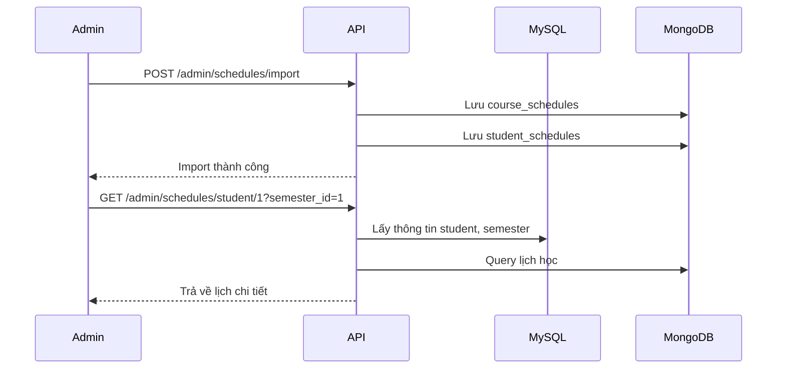
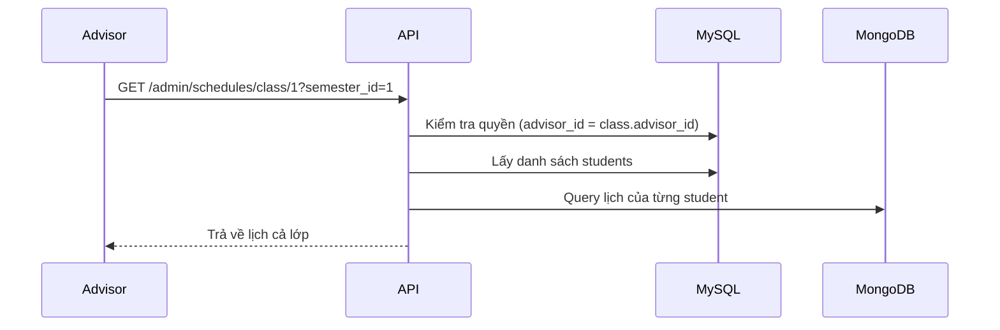
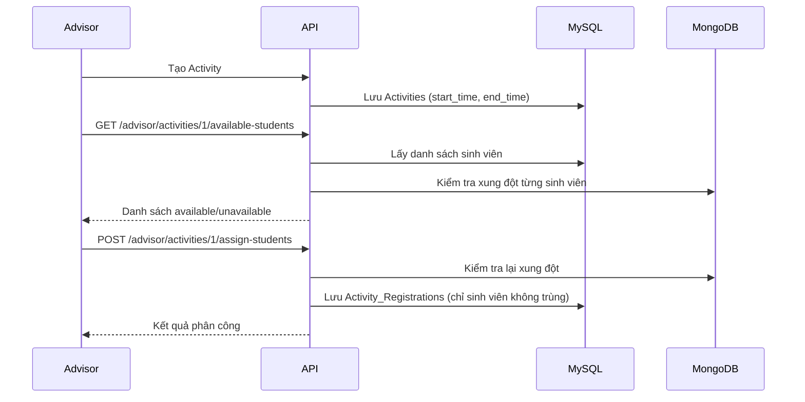
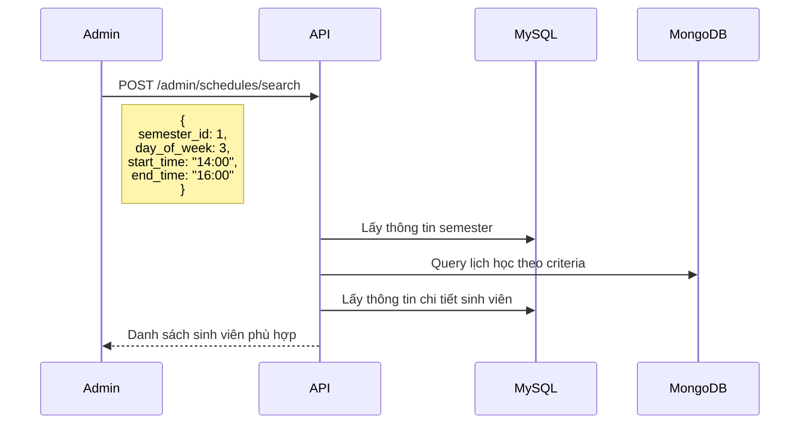

# API Documentation - Schedule Management System

## Tổng quan

Hệ thống quản lý lịch học sinh viên với MongoDB, hỗ trợ:
- ✅ **Nhiều giai đoạn học** (Lý thuyết, Thực hành) với ngày bắt đầu/kết thúc riêng
- ✅ **Phân biệt LT/TH** - Tự động phát hiện từ cột "Ghi chú"
- ✅ **Kiểm tra xung đột chính xác** - So sánh thời gian thực (H:i format)
- ✅ **Import Excel** - Template chuẩn với 2 sheets
- ✅ **Hybrid Database** - MySQL (Semesters) + MongoDB (Schedules)
- ✅ **Xem lịch học** - Theo sinh viên, lớp, học kỳ
- ✅ **Tìm kiếm nâng cao** - Theo thời gian, môn học, thứ
- ✅ **Phân quyền** - Admin, Advisor, Student

### Luồng hoạt động

1. **Import Excel**: Admin import file Excel chứa lịch học và đăng ký môn của sinh viên
2. **Lưu MongoDB**: Dữ liệu được lưu vào MongoDB với `semester` và `academic_year` từ Excel
3. **Xem lịch**: Admin/Advisor xem lịch học của sinh viên/lớp theo học kỳ
4. **Tìm kiếm**: Admin tìm sinh viên theo thời gian, môn học, thứ
5. **Check Conflict**: 
   - Client gửi request với `student_id`, `activity_id`, và `semester_id`
   - Backend lấy thông tin thời gian từ bảng `Activities` (MySQL)
   - Backend lấy `semester_name` và `academic_year` từ bảng `Semesters` (MySQL)
   - Dùng thông tin này để query lịch học trong MongoDB
   - So sánh thời gian để phát hiện xung đột
6. **Phân công hoạt động**: Advisor chỉ phân công sinh viên không trùng lịch

---

## 1. MongoDB Schema

### 1.1. Collection: `course_schedules`

Lưu thông tin lịch học của từng môn, mỗi môn có thể có nhiều giai đoạn.

```javascript
{
  _id: ObjectId("..."),
  course_code: "IT001",                    // Mã môn học
  course_name: "Nhập môn Lập trình",       // Tên môn học
  instructor: "ThS. Nguyễn Văn A",         // Giảng viên
  
  schedules: [                              // Danh sách giai đoạn
    {
      phase: "Lý thuyết",                   // Tên giai đoạn
      type: "LT",                           // LT hoặc TH (tự động phát hiện)
      start_date: ISODate("2024-09-05"),    // Ngày bắt đầu giai đoạn
      end_date: ISODate("2024-10-30"),      // Ngày kết thúc giai đoạn
      day_of_week: 2,                       // 2=Thứ 2, 3=Thứ 3, ..., 8=CN
      start_period: 1,                      // Tiết bắt đầu (1-17)
      end_period: 3,                        // Tiết kết thúc (1-17)
      start_time: "07:00",                  // Giờ bắt đầu (string H:i)
      end_time: "09:15",                    // Giờ kết thúc (string H:i)
      room: "B.101",                        // Phòng học
      note: "Lý thuyết"                     // Ghi chú
    },
    {
      phase: "Thực hành",
      type: "TH",
      start_date: ISODate("2024-11-01"),
      end_date: ISODate("2024-12-15"),
      day_of_week: 4,
      start_period: 4,
      end_period: 6,
      start_time: "09:15",
      end_time: "11:30",
      room: "H.201",
      note: "Thực hành"
    }
  ],
  
  updated_at: ISODate("2025-11-13T10:00:00Z")
}
```

**Indexes:**
```javascript
db.course_schedules.createIndex({ course_code: 1, academic_year: 1 }, { unique: true })
db.course_schedules.createIndex({ "schedules.day_of_week": 1 })
db.course_schedules.createIndex({ "schedules.start_date": 1, "schedules.end_date": 1 })
```

---

### 1.2. Collection: `student_schedules`

Lưu lịch học của từng sinh viên trong học kỳ.

**Lưu ý quan trọng:** 
- `semester` và `academic_year` trong MongoDB được lấy từ bảng `Semesters` trong MySQL
- Khi import Excel, hệ thống sẽ tự động map từ dữ liệu Excel sang MongoDB
- Khi query, API sẽ lấy thông tin từ MySQL (bằng `semester_id`) rồi dùng để tìm trong MongoDB

```javascript
{
  _id: ObjectId("..."),
  student_id: 1,                            // ID sinh viên (từ SQL)
  student_code: "210001",                   // MSSV
  student_name: "Nguyễn Văn Hùng",          // Họ tên
  class_id: 1,                              // ID lớp (từ SQL)
  class_name: "DH21CNTT",                   // Tên lớp
  semester: "1",                            // Tên học kỳ (HK1, HK2, HK3, Hè) - từ Semesters.semester_name
  academic_year: "2024-2025",               // Năm học - từ Semesters.academic_year
  
  registered_courses: [                     // Danh sách môn đã đăng ký
    {
      course_code: "IT001",
      course_name: "Nhập môn Lập trình",
      schedules: [
        {
          phase: "Lý thuyết",
          type: "LT",
          start_date: ISODate("2024-09-05"),
          end_date: ISODate("2024-10-30"),
          day_of_week: 2,
          start_period: 1,
          end_period: 3,
          start_time: "07:00",
          end_time: "09:15",
          room: "B.101",
          note: "Lý thuyết"
        },
        {
          phase: "Thực hành",
          type: "TH",
          start_date: ISODate("2024-11-01"),
          end_date: ISODate("2024-12-15"),
          day_of_week: 4,
          start_period: 4,
          end_period: 6,
          start_time: "09:15",
          end_time: "11:30",
          room: "H.201",
          note: "Thực hành"
        }
      ]
    }
  ],
  
  flat_schedule: [                          // Lịch học phẳng (để query nhanh)
    {
      course_code: "IT001",
      phase: "Lý thuyết",
      start_date: ISODate("2024-09-05"),
      end_date: ISODate("2024-10-30"),
      day_of_week: 2,
      periods: [1, 2, 3],
      start_time_str: "07:00",              // String để so sánh conflict
      end_time_str: "09:15",                // String để so sánh conflict
      time_range: "07:00-09:15",            // Hiển thị
      room: "B.101"
    },
    {
      course_code: "IT001",
      phase: "Thực hành",
      start_date: ISODate("2024-11-01"),
      end_date: ISODate("2024-12-15"),
      day_of_week: 4,
      periods: [4, 5, 6],
      start_time_str: "09:15",
      end_time_str: "11:30",
      time_range: "09:15-11:30",
      room: "H.201"
    }
  ],
  
  updated_at: ISODate("2025-11-13T10:00:00Z")
}
```

**Indexes:**
```javascript
db.student_schedules.createIndex({ student_id: 1, semester: 1, academic_year: 1 }, { unique: true })
db.student_schedules.createIndex({ class_id: 1, semester: 1, academic_year: 1 })
db.student_schedules.createIndex({ student_code: 1, semester: 1, academic_year: 1 })
db.student_schedules.createIndex({ "flat_schedule.day_of_week": 1 })
db.student_schedules.createIndex({ "flat_schedule.start_date": 1, "flat_schedule.end_date": 1 })
```

---

## 2. Excel Template Structure

### 2.1. Sheet 1: "Lịch lớp học"

| Cột | Tên | Kiểu dữ liệu | Bắt buộc | Ví dụ | Ghi chú |
|-----|-----|--------------|----------|-------|---------|
| A | STT | Number | Không | 1 | Số thứ tự |
| B | Mã lớp học | String | **Có** | IT001 | Mã môn học (unique) |
| C | Tên môn học | String | **Có** | Nhập môn Lập trình | Tên đầy đủ |
| D | Giảng viên | String | **Có** | ThS. Nguyễn Văn A | Họ tên GV |
| E | Giai đoạn | String | Không | Lý thuyết | Tên giai đoạn, mặc định "Toàn khóa" |
| F | Ngày bắt đầu | Date | **Có** | 05/09/2024 | Format: dd/mm/yyyy |
| G | Ngày kết thúc | Date | **Có** | 30/10/2024 | Format: dd/mm/yyyy |
| H | Thứ | Number/String | **Có** | 2 | 2-7 hoặc CN |
| I | Tiết bắt đầu | Number | **Có** | 1 | 1-17 |
| J | Tiết kết thúc | Number | **Có** | 3 | 1-17 |
| K | Phòng | String | **Có** | B.101 | Mã phòng học |
| L | Ghi chú | String | Không | Lý thuyết | Dùng để phát hiện LT/TH |

**Data Validation Rules:**
```excel
Cột H (Thứ): List = 2,3,4,5,6,7,CN
Cột I,J (Tiết): Whole number, Between 1 and 17
Cột F,G (Ngày): Date format dd/mm/yyyy
```

**Tự động phát hiện LT/TH:**
- Nếu cột "Ghi chú" chứa: `thực hành`, `thuc hanh`, `(th)`, `phòng máy`, `pm` → Type = **TH**
- Ngược lại → Type = **LT**

**Ví dụ dữ liệu:**
```
1  IT001  Nhập môn Lập trình  ThS. Nguyễn Văn A  Lý thuyết   05/09/2024  30/10/2024  2  1  3  B.101  Lý thuyết
2  IT001  Nhập môn Lập trình  ThS. Nguyễn Văn A  Thực hành  01/11/2024  15/12/2024  4  4  6  H.201  Thực hành
3  BA001  Kinh tế vi mô       TS. Trần Thị B     Toàn khóa  05/09/2024  15/12/2024  3  7  9  A.305  Lý thuyết
```

---

### 2.2. Sheet 2: "Đăng ký lớp"

| Cột | Tên | Kiểu dữ liệu | Bắt buộc | Ví dụ |
|-----|-----|--------------|----------|-------|
| A | STT | Number | Không | 1 |
| B | MSSV | String | **Có** | 210001 |
| C | Họ tên | String | **Có** | Nguyễn Văn Hùng |
| D | Lớp | String | **Có** | DH21CNTT |
| E | Mã lớp học | String | **Có** | IT001 |
| F | Học kỳ | String | **Có** | HK1 |
| G | Năm học | String | **Có** | 2024-2025 |

**Ví dụ dữ liệu:**
```
1  210001  Nguyễn Văn Hùng     DH21CNTT  IT001  HK1  2024-2025
2  210001  Nguyễn Văn Hùng     DH21CNTT  BA001  HK1  2024-2025
3  210002  Trần Thị Thu Cẩm    DH21CNTT  IT001  HK1  2024-2025
```

---

## 3. Time Mapping (Tiết → Giờ)

### 3.1. Lý thuyết (LT)

| Tiết | Giờ bắt đầu | Giờ kết thúc | Ca |
|------|-------------|--------------|-----|
| 1 | 07:00 | 07:45 | Sáng |
| 2 | 07:45 | 08:30 | Sáng |
| 3 | 08:30 | 09:15 | Sáng |
| 4 | 09:40 | 10:25 | Sáng |
| 5 | 10:25 | 11:10 | Sáng |
| 6 | 11:10 | 11:55 | Sáng |
| 7 | 12:30 | 13:15 | Chiều |
| 8 | 13:15 | 14:00 | Chiều |
| 9 | 14:00 | 14:45 | Chiều |
| 10 | 15:10 | 15:55 | Chiều |
| 11 | 15:55 | 16:40 | Chiều |
| 12 | 16:40 | 17:25 | Chiều |
| 13 | 18:00 | 18:45 | Tối |
| 14 | 18:45 | 19:30 | Tối |
| 15 | 19:30 | 20:15 | Tối |
| 16 | 20:15 | 21:00 | Tối |
| 17 | 21:00 | 21:45 | Tối |

---

### 3.2. Thực hành (TH)

| Tiết | Giờ bắt đầu | Giờ kết thúc | Ca |
|------|-------------|--------------|-----|
| 1 | 07:00 | 07:45 | Sáng |
| 2 | 07:45 | 08:30 | Sáng |
| 3 | 08:30 | 09:15 | Sáng |
| 4 | 09:15 | 10:00 | Sáng |
| 5 | 10:00 | 10:45 | Sáng |
| 6 | 10:45 | 11:30 | Sáng |
| 7 | 12:30 | 13:15 | Chiều |
| 8 | 13:15 | 14:00 | Chiều |
| 9 | 14:00 | 14:45 | Chiều |
| 10 | 14:45 | 15:30 | Chiều |
| 11 | 15:30 | 16:15 | Chiều |
| 12 | 16:15 | 17:00 | Chiều |
| 13 | 18:00 | 18:45 | Tối |
| 14 | 18:45 | 19:30 | Tối |
| 15 | 19:30 | 20:15 | Tối |
| 16 | 20:15 | 21:00 | Tối |
| 17 | 21:00 | 21:45 | Tối |
POST /api/admin/schedules/import
```

**Role:** `admin` only

**Headers:**
```
Authorization: Bearer {token}
Content-Type: multipart/form-data
```

**Request Body:**
```
file: lich_hoc_sinh_vien.xlsx
```

**Response Success (200):**
```json
{
  "success": true,
  "message": "Import thành công",
  "data": {
    "courses_imported": 45,
    "students_imported": 150
  }
}
```

**Response Error (422):**
```json
{
  "success": false,
  "message": "File không hợp lệ",
  "errors": {
    "file": ["The file field is required."]
  }
}
```

**Response Error (500):**
```json
{
  "success": false,
  "message": "Lỗi khi import: Invalid date format for course IT001"
}
```

---

### 4.2. Get Student Schedule

**Xem lịch học của một sinh viên cụ thể**

**Endpoint:**
```
GET /api/admin/schedules/student/{student_id}
```

**Role:** `admin`, `advisor` (chỉ xem sinh viên trong lớp mình quản lý)

**Headers:**
```
Authorization: Bearer {token}
```

**Query Parameters:**
- `semester_id` (optional): ID học kỳ cần xem
  - Nếu có: Trả về lịch của học kỳ đó
  - Nếu không có: Trả về tất cả lịch của sinh viên

**Example 1 - Xem lịch một học kỳ:**
```
GET /api/admin/schedules/student/1?semester_id=1
```

**Response Success (200):**
```json
{
  "success": true,
  "data": {
    "student": {
      "student_id": 1,
      "user_code": "210001",
      "full_name": "Nguyễn Văn Hùng",
      "email": "sv.hung@school.edu.vn",
      "phone_number": "091122334",
      "class_name": "DH21CNTT",
      "faculty_name": "Khoa Công nghệ Thông tin",
      "advisor_name": "ThS. Trần Văn An",
      "status": "studying",
      "position": "leader"
    },
    "semester": {
      "semester_id": 1,
      "semester_name": "Học kỳ 1",
      "academic_year": "2024-2025",
      "start_date": "2024-09-05",
      "end_date": "2025-01-15"
    },
    "schedule": {
      "total_courses": 5,
      "registered_courses": [
        {
          "course_code": "IT001",
          "course_name": "Nhập môn Lập trình",
          "schedules": [
            {
              "phase": "Lý thuyết",
              "type": "LT",
              "start_date": "2024-09-05T00:00:00.000Z",
              "end_date": "2024-10-30T00:00:00.000Z",
              "day_of_week": 2,
              "start_period": 1,
              "end_period": 3,
              "start_time": "07:00",
              "end_time": "09:15",
              "room": "B.101",
              "note": "Lý thuyết"
            }
          ]
        }
      ],
      "flat_schedule": [
        {
          "course_code": "IT001",
          "phase": "Lý thuyết",
          "start_date": "2024-09-05T00:00:00.000Z",
          "end_date": "2024-10-30T00:00:00.000Z",
          "day_of_week": 2,
          "periods": [1, 2, 3],
          "start_time_str": "07:00",
          "end_time_str": "09:15",
          "time_range": "07:00-09:15",
          "room": "B.101"
        }
      ],
      "updated_at": "2025-11-13T10:00:00.000Z"
    },
    "has_schedule": true
  }
}
```

**Example 2 - Xem tất cả lịch:**
```
GET /api/admin/schedules/student/1
```

**Response Success (200):**
```json
{
  "success": true,
  "data": {
    "student": {
      "student_id": 1,
      "user_code": "210001",
      "full_name": "Nguyễn Văn Hùng",
      "email": "sv.hung@school.edu.vn",
      "class_name": "DH21CNTT",
      "faculty_name": "Khoa Công nghệ Thông tin"
    },
    "total_semesters": 3,
    "schedules": [
      {
        "semester": "1",
        "academic_year": "2024-2025",
        "total_courses": 5,
        "registered_courses": [...],
        "flat_schedule": [...],
        "updated_at": "2025-11-13T10:00:00.000Z"
      },
      {
        "semester": "2",
        "academic_year": "2023-2024",
        "total_courses": 6,
        "registered_courses": [...],
        "flat_schedule": [...],
        "updated_at": "2024-03-15T08:00:00.000Z"
      }
    ]
  }
}
```

**Response Error (403):**
```json
{
  "success": false,
  "message": "Bạn không phải cố vấn của sinh viên này"
}
```

**Response Error (404):**
```json
{
  "success": false,
  "message": "Không tìm thấy sinh viên"
}
```

---

### 4.3. Get Class Schedule

**Xem lịch học của cả lớp**

**Endpoint:**
```
GET /api/admin/schedules/class/{class_id}
```

**Role:** `admin`, `advisor` (chỉ xem lớp mình quản lý)

**Headers:**
```
Authorization: Bearer {token}
```

**Query Parameters:**
- `semester_id` (required): ID học kỳ cần xem

**Example:**
```
GET /api/admin/schedules/class/1?semester_id=1
```

**Response Success (200):**
```json
{
  "success": true,
  "data": {
    "class": {
      "class_id": 1,
      "class_name": "DH21CNTT",
      "description": "Lớp Đại học 2021 ngành Công nghệ Thông tin",
      "advisor_name": "ThS. Trần Văn An",
      "advisor_email": "gv.an@school.edu.vn",
      "faculty_name": "Khoa Công nghệ Thông tin"
    },
    "semester": {
      "semester_id": 1,
      "semester_name": "Học kỳ 1",
      "academic_year": "2024-2025",
      "start_date": "2024-09-05",
      "end_date": "2025-01-15"
    },
    "summary": {
      "total_students": 45,
      "students_with_schedule": 43,
      "students_without_schedule": 2
    },
    "students": [
      {
        "student_id": 1,
        "user_code": "210001",
        "full_name": "Nguyễn Văn Hùng",
        "email": "sv.hung@school.edu.vn",
        "phone_number": "091122334",
        "position": "leader",
        "status": "studying",
        "has_schedule": true,
        "total_courses": 5,
        "registered_courses": [...],
        "flat_schedule": [...]
      },
      {
        "student_id": 2,
        "user_code": "210002",
        "full_name": "Trần Thị Thu Cẩm",
        "email": "sv.cam@school.edu.vn",
        "phone_number": "091234567",
        "position": "secretary",
        "status": "studying",
        "has_schedule": false,
        "total_courses": 0,
        "registered_courses": [],
        "flat_schedule": []
      }
    ]
  }
}
```

**Response Error (403):**
```json
{
  "success": false,
  "message": "Bạn không phải cố vấn của lớp này"
}
```

**Response Error (422):**
```json
{
  "success": false,
  "message": "Vui lòng cung cấp semester_id"
}
```

---

### 4.4. Search by Schedule

**Tìm kiếm sinh viên theo lịch học**

**Endpoint:**
```
POST /api/admin/schedules/search
```

**Role:** `admin` only

**Headers:**
```
Authorization: Bearer {token}
Content-Type: application/json
```

**Request Body:**
```json
{
  "semester_id": 1,              // Required
  "class_id": 1,                 // Optional - Lọc theo lớp
  "day_of_week": 3,              // Optional - 2=Thứ 2, ..., 8=CN
  "start_time": "14:00",         // Optional - Giờ bắt đầu (H:i)
  "end_time": "16:00",           // Optional - Giờ kết thúc (H:i)
  "course_code": "IT001"         // Optional - Mã môn học
}
```

**Validation Rules:**
```
semester_id: required|integer|exists:Semesters,semester_id
class_id: nullable|integer|exists:Classes,class_id
day_of_week: nullable|integer|min:2|max:8
start_time: nullable|date_format:H:i
end_time: nullable|date_format:H:i
course_code: nullable|string
```

**Use Cases:**

**1. Tìm sinh viên có lịch vào Thứ 3:**
```json
{
  "semester_id": 1,
  "day_of_week": 3
}
```

**2. Tìm sinh viên học môn IT001:**
```json
{
  "semester_id": 1,
  "course_code": "IT001"
}
```

**3. Tìm sinh viên có lịch từ 14:00-16:00:**
```json
{
  "semester_id": 1,
  "start_time": "14:00",
  "end_time": "16:00"
}
```

**4. Tìm sinh viên lớp DH21CNTT có lịch Thứ 3 từ 14:00-16:00:**
```json
{
  "semester_id": 1,
  "class_id": 1,
  "day_of_week": 3,
  "start_time": "14:00",
  "end_time": "16:00"
}
```

**Response Success (200):**
```json
{
  "success": true,
  "data": {
    "semester": {
      "semester_id": 1,
      "semester_name": "Học kỳ 1",
      "academic_year": "2024-2025"
    },
    "search_criteria": {
      "class_id": 1,
      "day_of_week": 3,
      "start_time": "14:00",
      "end_time": "16:00",
      "course_code": null
    },
    "total_found": 12,
    "students": [
      {
        "student_id": 1,
        "user_code": "210001",
        "full_name": "Nguyễn Văn Hùng",
        "email": "sv.hung@school.edu.vn",
        "phone_number": "091122334",
        "class_name": "DH21CNTT",
        "position": "leader",
        "matched_schedules": [
          {
            "course_code": "IT001",
            "phase": "Lý thuyết",
            "start_date": "2024-09-05T00:00:00.000Z",
            "end_date": "2024-10-30T00:00:00.000Z",
            "day_of_week": 3,
            "periods": [9, 10, 11],
            "start_time_str": "14:00",
            "end_time_str": "16:40",
            "time_range": "14:00-16:40",
            "room": "B.101"
          }
        ]
      }
    ]
  }
}
```

**Response Error (403):**
```json
{
  "success": false,
  "message": "Chỉ Admin mới có quyền tìm kiếm lịch học"
}
```

---

### 4.5. Delete Student Schedule

**Xóa lịch học của sinh viên trong một học kỳ**

**Endpoint:**
```
DELETE /api/admin/schedules/student/{student_id}
```

**Role:** `admin` only

**Headers:**
```
Authorization: Bearer {token}
Content-Type: application/json
```

**Request Body:**
```json
{
  "semester_id": 1
}
```

**Validation Rules:**
```
student_id: required|integer|exists:Students,student_id
semester_id: required|integer|exists:Semesters,semester_id
```

**Response Success (200):**
```json
{
  "success": true,
  "message": "Đã xóa lịch học thành công"
}
```

**Response Error (404):**
```json
{
  "success": false,
  "message": "Không tìm thấy lịch học để xóa"
}
```

**Response Error (403):**
```json
{
  "success": false,
  "message": "Chỉ Admin mới có quyền xóa lịch học"
}
```

**Lưu ý:**
- Chỉ xóa dữ liệu trong MongoDB, không ảnh hưởng đến MySQL
- Có thể import lại nếu cần

---

### 4.6. Check Schedule Conflict

**Kiểm tra xung đột lịch học của sinh viên với hoạt động**

**Endpoint:**
```
POST /api/schedules/check-conflict
```

**Role:** `student` (own), `advisor`, `admin`

**Headers:**
```
Authorization: Bearer {token}
Content-Type: application/json
```

**Request Body:**
```json
{
  "student_id": 1,
  "activity_id": 5,
  "semester_id": 1
}
```

**Validation Rules:**
```
student_id: required|integer|exists:Students,student_id
activity_id: required|integer|exists:Activities,activity_id
semester_id: required|integer|exists:Semesters,semester_id
```

**Lưu ý:** 
- API sẽ tự động lấy `start_time` và `end_time` từ bảng `Activities` trong MySQL
- API sẽ tự động lấy `semester_name` và `academic_year` từ bảng `Semesters` trong MySQL
- Sau đó sử dụng thông tin này để query lịch học trong MongoDB

**Response Success - No Conflict (200):**
```json
{
  "success": true,
  "data": {
    "has_conflict": false,
    "activity": {
      "activity_id": 5,
      "title": "Workshop AI",
      "start_time": "2024-10-15 14:00:00",
      "end_time": "2024-10-15 16:00:00"
    }
  }
}
```

**Response Success - Has Conflict (200):**
```json
{
  "success": true,
  "data": {
    "has_conflict": true,
    "conflict_course": "IT001",
    "conflict_phase": "Lý thuyết",
    "conflict_time": "14:00-16:40",
    "conflict_room": "B.101",
    "conflict_periods": [9, 10, 11],
    "conflict_date_range": "2024-09-05 đến 2024-10-30",
    "activity": {
      "activity_id": 5,
      "title": "Workshop AI",
      "start_time": "2024-10-15 14:00:00",
      "end_time": "2024-10-15 16:00:00"
    }
  }
}
```

**Response Error (422):**
```json
{
  "success": false,
  "errors": {
    "student_id": ["The student id field is required."]
  }
}
```

---

### 4.7. Get Available Students for Activity

**Lấy danh sách sinh viên có thể tham gia hoạt động (không trùng lịch)**

**Endpoint:**
```
GET /api/advisor/activities/{activity_id}/available-students
```

**Role:** `advisor` only (người tạo hoạt động)

**Headers:**
```
Authorization: Bearer {token}
```

**Response Success (200):**
```json
{
  "success": true,
  "data": {
    "activity": {
      "activity_id": 1,
      "title": "Workshop AI",
      "start_time": "2024-10-15 14:00:00",
      "end_time": "2024-10-15 16:00:00",
      "status": "upcoming"
    },
    "semester": {
      "semester_id": 1,
      "semester": "1",
      "academic_year": "2024-2025"
    },
    "summary": {
      "total_students": 120,
      "available_count": 95,
      "unavailable_count": 25
    },
    "available_students": [
      {
        "student_id": 1,
        "user_code": "210001",
        "full_name": "Nguyễn Văn Hùng",
        "email": "sv.hung@school.edu.vn",
        "phone_number": "091122334",
        "class_name": "DH21CNTT",
        "training_point": 85,
        "social_point": 15,
        "can_assign": true,
        "reason_cannot_assign": null
      }
    ],
    "unavailable_students": [
      {
        "student_id": 2,
        "user_code": "210002",
        "full_name": "Trần Thị Thu Cẩm",
        "email": "sv.cam@school.edu.vn",
        "phone_number": "091234567",
        "class_name": "DH21CNTT",
        "training_point": 70,
        "social_point": 5,
        "can_assign": false,
        "reason_cannot_assign": "Trùng môn IT001 (14:00-16:40)"
      }
    ]
  }
}
```

**Response Error (404):**
```json
{
  "success": false,
  "message": "Hoạt động không tồn tại"
}
```

**Response Error (403):**
```json
{
  "success": false,
  "message": "Bạn không có quyền xem danh sách này"
}
```

---

### 4.8. Assign Students to Activity

**Phân công sinh viên tham gia hoạt động (chỉ sinh viên không trùng lịch)**

**Endpoint:**
```
POST /api/advisor/activities/{activity_id}/assign-students
```

**Role:** `advisor` only (người tạo hoạt động)

**Headers:**
```
Authorization: Bearer {token}
Content-Type: application/json
```

**Request Body:**
```json
{
  "assignments": [
    {
      "student_id": 1,
      "activity_role_id": 2
    },
    {
      "student_id": 3,
      "activity_role_id": 2
    },
    {
      "student_id": 5,
      "activity_role_id": 3
    }
  ]
}
```

**Validation Rules:**
```
assignments: required|array|min:1
assignments.*.student_id: required|integer|exists:Students,student_id
assignments.*.activity_role_id: required|integer|exists:Activity_Roles,activity_role_id
```

**Response Success (200):**
```json
{
  "success": true,
  "message": "Phân công thành công 2 sinh viên, bỏ qua 1",
  "data": {
    "total_assigned": 2,
    "total_skipped": 1,
    "assigned": [
      {
        "registration_id": 101,
        "student_id": 1,
        "student_code": "210001",
        "student_name": "Nguyễn Văn Hùng",
        "role_name": "Người tham dự",
        "points_awarded": 8,
        "point_type": "ren_luyen"
      },
      {
        "registration_id": 102,
        "student_id": 3,
        "student_code": "220001",
        "student_name": "Lê Văn Dũng",
        "role_name": "Người tham dự",
        "points_awarded": 8,
        "point_type": "ren_luyen"
      }
    ],
    "skipped": [
      {
        "student_id": 5,
        "student_name": "Bùi Thị Hương",
        "reason": "Trùng môn IT001 (14:00-16:40)"
      }
    ]
  }
}
```

**Response Error (400):**
```json
{
  "success": false,
  "message": "Không thể phân công cho hoạt động đã hoàn thành hoặc bị hủy"
}
```

---

### 4.9. Download Template

**Tải file Excel template mẫu**

**Endpoint:**
```
GET /api/schedules/template/download
```

**Role:** `admin`, `advisor`

**Headers:**
```
Authorization: Bearer {token}
```

**Response:**
- File download: `lich_hoc_template_20251113.xlsx`

---

## 5. Authorization Matrix

**Bảng phân quyền chi tiết cho từng API**

| API Endpoint | Admin | Advisor | Student | Ghi chú |
|--------------|-------|---------|---------|---------|
| Import Schedule | ✅ | ❌ | ❌ | Chỉ Admin |
| Get Student Schedule | ✅ | ✅* | ❌ | *Advisor: chỉ lớp mình quản lý |
| Get Class Schedule | ✅ | ✅* | ❌ | *Advisor: chỉ lớp mình quản lý |
| Search by Schedule | ✅ | ❌ | ❌ | Chỉ Admin |
| Delete Schedule | ✅ | ❌ | ❌ | Chỉ Admin |
| Check Conflict | ✅ | ✅ | ✅* | *Student: chỉ lịch của mình |
| Get Available Students | ✅ | ✅* | ❌ | *Advisor: chỉ hoạt động mình tạo |
| Assign Students | ✅ | ✅* | ❌ | *Advisor: chỉ hoạt động mình tạo |
| Download Template | ✅ | ✅ | ❌ | Admin và Advisor |

---

## 6. Conflict Detection Logic

### 6.1. Thuật toán kiểm tra xung đột

Hệ thống sử dụng **3 bước kiểm tra**:

#### Bước 1: Kiểm tra Thứ
```php
if ($schedule['day_of_week'] != $activityDayOfWeek) {
    continue; // Không trùng thứ → Không xung đột
}
```

#### Bước 2: Kiểm tra Giai đoạn (Ngày)
```php
$activityDate = "2024-10-15";
$schedStart = "2024-09-05";
$schedEnd = "2024-10-30";

if ($activityDate < $schedStart || $activityDate > $schedEnd) {
    continue; // Hoạt động không nằm trong giai đoạn học → Không xung đột
}
```

#### Bước 3: Kiểm tra Giờ trùng
```php
// Logic overlap: (StartA < EndB) AND (EndA > StartB)
$actStartStr = "14:00";
$actEndStr = "16:00";
$classStartStr = "14:00";
$classEndStr = "16:40";

if ($actStartStr < $classEndStr && $actEndStr > $classStartStr) {
    return ['has_conflict' => true]; // Có xung đột
}
```

### 6.2. Ví dụ thực tế

**Lịch học sinh viên:**
- Môn IT001 - Lý thuyết
  - Giai đoạn: 05/09/2024 → 30/10/2024
  - Thứ 3 (day_of_week = 3)
  - Giờ: 14:00 → 16:40

**Hoạt động:**
- Ngày: 15/10/2024 (Thứ 3)
- Giờ: 14:00 → 16:00

**Kết quả:**
1. ✅ Cùng thứ 3
2. ✅ Ngày 15/10 nằm trong giai đoạn 05/09 → 30/10
3. ✅ Giờ trùng: 14:00 < 16:40 AND 16:00 > 14:00

→ **Có xung đột!**

---

## 7. Workflow Examples

### 7.1. Workflow: Admin import và quản lý lịch học



### 7.2. Workflow: Advisor xem lịch lớp



### 7.3. Workflow: Phân công sinh viên tham gia hoạt động



### 7.4. Workflow: Admin tìm kiếm sinh viên rảnh



---

## 8. Error Codes

| HTTP Code | Error Type | Description | Example |
|-----------|------------|-------------|---------|
| 200 | Success | Thành công | Import, query thành công |
| 400 | Bad Request | Dữ liệu không hợp lệ (status, logic) | Activity đã hoàn thành |
| 401 | Unauthorized | Chưa đăng nhập hoặc token hết hạn | Token expired |
| 403 | Forbidden | Không có quyền truy cập | Advisor xem lớp khác |
| 404 | Not Found | Không tìm thấy tài nguyên | Student/Activity không tồn tại |
| 422 | Validation Error | Validation failed | Missing required fields |
| 500 | Server Error | Lỗi server | MongoDB connection error |

---

## 9. Testing Guide

### 9.1. Test Import Schedule

**Postman:**
```bash
POST http://localhost:8000/api/admin/schedules/import
Authorization: Bearer {admin_token}
Content-Type: multipart/form-data

Body:
- file: lich_hoc_sinh_vien.xlsx
```

**cURL:**
```bash
curl -X POST \
  http://localhost:8000/api/admin/schedules/import \
  -H 'Authorization: Bearer {admin_token}' \
  -F 'file=@/path/to/lich_hoc_sinh_vien.xlsx'
```

**Expected Result:**
```json
{
  "success": true,
  "message": "Import thành công",
  "data": {
    "courses_imported": 45,
    "students_imported": 150
  }
}
```

---

### 9.2. Test Get Student Schedule

**Postman:**
```bash
GET http://localhost:8000/api/admin/schedules/student/1?semester_id=1
Authorization: Bearer {admin_token}
```

**cURL:**
```bash
curl -X GET \
  'http://localhost:8000/api/admin/schedules/student/1?semester_id=1' \
  -H 'Authorization: Bearer {admin_token}'
```

**Test Cases:**
1. ✅ Admin xem bất kỳ sinh viên nào
2. ✅ Advisor xem sinh viên trong lớp mình quản lý
3. ❌ Advisor xem sinh viên lớp khác → 403 Forbidden
4. ✅ Không có semester_id → Trả về tất cả học kỳ
5. ✅ Có semester_id → Trả về học kỳ cụ thể

---

### 9.3. Test Get Class Schedule

**Postman:**
```bash
GET http://localhost:8000/api/admin/schedules/class/1?semester_id=1
Authorization: Bearer {advisor_token}
```

**cURL:**
```bash
curl -X GET \
  'http://localhost:8000/api/admin/schedules/class/1?semester_id=1' \
  -H 'Authorization: Bearer {advisor_token}'
```

**Test Cases:**
1. ✅ Admin xem bất kỳ lớp nào
2. ✅ Advisor xem lớp mình quản lý
3. ❌ Advisor xem lớp khác → 403 Forbidden
4. ❌ Không có semester_id → 422 Validation Error
5. ✅ Kiểm tra summary (total_students, students_with_schedule)

---

### 9.4. Test Search by Schedule

**Postman:**
```bash
POST http://localhost:8000/api/admin/schedules/search
Authorization: Bearer {admin_token}
Content-Type: application/json

Body:
{
  "semester_id": 1,
  "day_of_week": 3,
  "start_time": "14:00",
  "end_time": "16:00",
  "class_id": 1
}
```

**cURL:**
```bash
curl -X POST \
  http://localhost:8000/api/admin/schedules/search \
  -H 'Authorization: Bearer {admin_token}' \
  -H 'Content-Type: application/json' \
  -d '{
    "semester_id": 1,
    "day_of_week": 3,
    "start_time": "14:00",
    "end_time": "16:00"
  }'
```

**Test Cases:**
1. ✅ Tìm theo thứ only
2. ✅ Tìm theo thời gian only
3. ✅ Tìm theo môn học only
4. ✅ Tìm theo lớp only
5. ✅ Kết hợp nhiều tiêu chí
6. ❌ Advisor gọi API → 403 Forbidden

---

### 9.5. Test Check Conflict

**Postman:**
```bash
POST http://localhost:8000/api/schedules/check-conflict
Authorization: Bearer {token}
Content-Type: application/json

Body:
{
  "student_id": 1,
  "activity_id": 5,
  "semester_id": 1
}
```

**cURL:**
```bash
curl -X POST \
  http://localhost:8000/api/schedules/check-conflict \
  -H 'Authorization: Bearer {token}' \
  -H 'Content-Type: application/json' \
  -d '{
    "student_id": 1,
    "activity_id": 5,
    "semester_id": 1
  }'
```

**Test Cases:**
1. ✅ Không xung đột → has_conflict: false
2. ✅ Có xung đột → has_conflict: true + chi tiết
3. ✅ Activity khác thứ → Không xung đột
4. ✅ Activity ngoài giai đoạn → Không xung đột
5. ✅ Activity trùng giờ → Xung đột

---

### 9.6. Test Delete Schedule

**Postman:**
```bash
DELETE http://localhost:8000/api/admin/schedules/student/2
Authorization: Bearer {admin_token}
Content-Type: application/json

Body:
{
  "semester_id": 1
}
```

**cURL:**
```bash
curl -X DELETE \
  http://localhost:8000/api/admin/schedules/student/2 \
  -H 'Authorization: Bearer {admin_token}' \
  -H 'Content-Type: application/json' \
  -d '{"semester_id": 1}'
```

**Test Cases:**
1. ✅ Admin xóa thành công
2. ❌ Advisor gọi API → 403 Forbidden
3. ❌ Lịch không tồn tại → 404 Not Found
4. ✅ Kiểm tra MongoDB (lịch đã bị xóa)

---

## 10. Setup Instructions

### 10.1. MongoDB Setup

```bash
# Install MongoDB
sudo apt-get install mongodb

# Start MongoDB
sudo systemctl start mongodb

# Create database
mongo
use advisor_system

# Create indexes
db.course_schedules.createIndex({ course_code: 1 })
db.student_schedules.createIndex({ student_id: 1, semester: 1, academic_year: 1 }, { unique: true })
db.student_schedules.createIndex({ student_code: 1, semester: 1, academic_year: 1 })
db.student_schedules.createIndex({ class_id: 1, semester: 1, academic_year: 1 })
db.student_schedules.createIndex({ "flat_schedule.day_of_week": 1 })
db.student_schedules.createIndex({ "flat_schedule.start_date": 1, "flat_schedule.end_date": 1 })
```

---

### 10.2. Laravel Setup

**.env:**
```env
MONGODB_URI=mongodb://localhost:27017
MONGODB_DATABASE=advisor_system
```

**Install PHP MongoDB Extension:**
```bash
sudo pecl install mongodb
echo "extension=mongodb.so" | sudo tee -a /etc/php/8.2/cli/php.ini
```

**Install Composer Package:**
```bash
composer require mongodb/laravel-mongodb
composer require phpoffice/phpspreadsheet
```

---

### 10.3. Routes Setup

**File: routes/api.php**

```php
use App\Http\Controllers\ScheduleImportController;

// Admin only
Route::middleware(['auth.api', 'check_role:admin'])->group(function () {
    Route::post('/admin/schedules/import', [ScheduleImportController::class, 'import']);
    Route::post('/admin/schedules/search', [ScheduleImportController::class, 'searchBySchedule']);
    Route::delete('/admin/schedules/student/{student_id}', [ScheduleImportController::class, 'deleteStudentSchedule']);
});

// Admin & Advisor
Route::middleware(['auth.api', 'check_role:admin,advisor'])->group(function () {
    Route::get('/admin/schedules/student/{student_id}', [ScheduleImportController::class, 'getStudentSchedule']);
    Route::get('/admin/schedules/class/{class_id}', [ScheduleImportController::class, 'getClassSchedule']);
});

// All authenticated users
Route::middleware(['auth.api'])->group(function () {
    Route::post('/schedules/check-conflict', [ScheduleImportController::class, 'checkConflict']);
});
```

---

### 10.4. Import Sample Data

**Steps:**
1. Download template: `GET /api/schedules/template/download`
2. Fill data theo hướng dẫn trong Section 2
3. Import: `POST /api/admin/schedules/import`
4. Verify: `GET /api/admin/schedules/student/1?semester_id=1`

---

## 11. Performance Optimization

### 11.1. MongoDB Indexes

**Essential Indexes:**
```javascript
// Primary lookup index
db.student_schedules.createIndex(
  { student_code: 1, semester: 1, academic_year: 1 }, 
  { unique: true }
)

// Class schedule lookup
db.student_schedules.createIndex(
  { class_id: 1, semester: 1, academic_year: 1 }
)

// Search by day of week
db.student_schedules.createIndex(
  { "flat_schedule.day_of_week": 1 }
)

// Search by date range
db.student_schedules.createIndex(
  { "flat_schedule.start_date": 1, "flat_schedule.end_date": 1 }
)
```

### 11.2. Query Optimization Tips

**1. Always use indexes:**
```php
// Good - Sử dụng index
$schedule = $db->student_schedules->findOne([
    'student_code' => $studentCode,  // Indexed
    'semester' => $semesterName,     // Indexed
    'academic_year' => $academicYear // Indexed
]);

// Bad - Không sử dụng index
$schedule = $db->student_schedules->findOne([
    'student_name' => 'Nguyễn Văn A'  // Not indexed
]);
```

**2. Limit returned fields:**
```php
// Good - Chỉ lấy field cần thiết
$schedule = $db->student_schedules->findOne(
    ['student_code' => $studentCode],
    ['projection' => ['flat_schedule' => 1, '_id' => 0]]
);

// Bad - Lấy toàn bộ document
$schedule = $db->student_schedules->findOne(
    ['student_code' => $studentCode]
);
```

**3. Batch operations:**
```php
// Good - Query 1 lần cho nhiều students
$studentCodes = [210001, 210002, 210003];
$schedules = $db->student_schedules->find([
    'student_code' => ['$in' => $studentCodes]
])->toArray();

// Bad - Query nhiều lần
foreach ($studentCodes as $code) {
    $schedule = $db->student_schedules->findOne(['student_code' => $code]);
}
```

---

## 12. Troubleshooting

### 12.1. Common Issues

**Issue 1: Không tìm thấy lịch học trong MongoDB**

**Symptoms:**
```json
{
  "success": true,
  "data": {
    "has_schedule": false
  }
}
```

**Solutions:**
1. Kiểm tra `student_code` phải là số nguyên:
```php
$studentCode = intval($student->user_code);  // 210001, không phải "210001"
```

2. Kiểm tra `semester` và `academic_year` phải trim():
```php
$semesterName = trim($semester->semester_name);
$academicYear = trim($semester->academic_year);
```

3. Kiểm tra dữ liệu trong MongoDB:
```bash
mongo
use advisor_system
db.student_schedules.findOne({student_code: 210001})
```

---

**Issue 2: Conflict detection không chính xác**

**Symptoms:**
- Báo xung đột khi không nên
- Không báo xung đột khi nên

**Solutions:**
1. Kiểm tra mapping thứ (Sunday = 8, Monday = 2):
```php
$activityDayOfWeek = $actStartObj->dayOfWeek == 0 ? 8 : $actStartObj->dayOfWeek + 1;
```

2. Kiểm tra format thời gian (H:i, không phải H:i:s):
```php
$actStartStr = $actStartObj->format('H:i');  // "14:00", không phải "14:00:00"
$actEndStr = $actEndObj->format('H:i');
```

3. Kiểm tra logic overlap:
```php
// Đúng
if ($actStartStr < $classEndStr && $actEndStr > $classStartStr) {
    // Có xung đột
}

// Sai
if ($actStartStr == $classStartStr || $actEndStr == $classEndStr) {
    // Logic không đầy đủ
}
```

---

**Issue 3: Advisor không xem được lịch sinh viên**

**Symptoms:**
```json
{
  "success": false,
  "message": "Bạn không phải cố vấn của sinh viên này"
}
```

**Solutions:**
1. Kiểm tra relationship trong MySQL:
```sql
SELECT s.student_id, s.user_code, s.class_id, c.advisor_id
FROM Students s
JOIN Classes c ON s.class_id = c.class_id
WHERE s.student_id = 1;
```

2. Kiểm tra middleware gán đúng advisor_id:
```php
$currentUserId = $request->current_user_id;  // Phải là advisor_id từ JWT
```

---

**Issue 4: Import Excel failed**

**Symptoms:**
```json
{
  "success": false,
  "message": "Lỗi khi import: Invalid date format for course IT001"
}
```

**Solutions:**
1. Kiểm tra format ngày trong Excel (dd/mm/yyyy):
```excel
Đúng: 05/09/2024
Sai: 2024-09-05, 09/05/2024
```

2. Kiểm tra Excel có đúng 2 sheets:
- Sheet 1: "Lịch lớp học"
- Sheet 2: "Đăng ký lớp"

3. Kiểm tra cột "Thứ" (2-7 hoặc CN):
```excel
Đúng: 2, 3, 4, 5, 6, 7, CN
Sai: Thứ 2, T2, Monday
```

---

**Issue 5: MongoDB connection error**

**Symptoms:**
```
MongoConnectionException: Failed to connect to MongoDB
```

**Solutions:**
1. Kiểm tra MongoDB đang chạy:
```bash
sudo systemctl status mongodb
sudo systemctl start mongodb
```

2. Kiểm tra .env:
```env
MONGODB_URI=mongodb://localhost:27017
MONGODB_DATABASE=advisor_system
```

3. Kiểm tra PHP MongoDB extension:
```bash
php -m | grep mongodb
```

---

### 12.2. Debug Tips

**1. Enable MongoDB Query Logging:**
```php
// Trong ScheduleService
use Illuminate\Support\Facades\Log;

// Log query trước khi execute
Log::info('MongoDB Query', [
    'collection' => 'student_schedules',
    'query' => [
        'student_code' => $studentCode,
        'semester' => $semesterName,
        'academic_year' => $academicYear
    ]
]);
```

**2. Check Middleware Values:**
```php
// Trong Controller
Log::info('Middleware values', [
    'current_role' => $request->current_role,
    'current_user_id' => $request->current_user_id
]);
```

**3. Dump MongoDB Document:**
```php
$schedule = $db->student_schedules->findOne([...]);
Log::info('Schedule from MongoDB', ['schedule' => $schedule]);
```

---

## 13. Best Practices

### 13.1. API Design

**1. Consistent Response Format:**
```json
// Success
{
  "success": true,
  "data": {...}
}

// Error
{
  "success": false,
  "message": "Error message",
  "errors": {...}  // Optional for validation errors
}
```

**2. Use HTTP Status Codes Correctly:**
- 200: Success
- 400: Bad Request (logic errors)
- 401: Unauthorized (missing/invalid token)
- 403: Forbidden (insufficient permissions)
- 404: Not Found
- 422: Validation Error
- 500: Server Error

**3. Validate Early:**
```php
// Validate trước khi query database
$validator = Validator::make($request->all(), [
    'student_id' => 'required|integer|exists:Students,student_id',
    'semester_id' => 'required|integer|exists:Semesters,semester_id'
]);

if ($validator->fails()) {
    return response()->json([
        'success' => false,
        'errors' => $validator->errors()
    ], 422);
}
```

---

### 13.2. Security

**1. Always Check Permissions:**
```php
// Advisor chỉ xem lớp mình quản lý
if ($currentRole === 'advisor' && $class->advisor_id != $currentUserId) {
    return response()->json([
        'success' => false,
        'message' => 'Bạn không phải cố vấn của lớp này'
    ], 403);
}
```

**2. Sanitize User Input:**
```php
// Trim và convert type
$studentCode = intval(trim($student->user_code));
$semesterName = trim($semester->semester_name);
```

**3. Log Important Actions:**
```php
Log::info('Schedule deleted', [
    'admin_id' => $currentUserId,
    'student_id' => $student_id,
    'semester_id' => $semesterId,
    'ip' => $request->ip()
]);
```

---

### 13.3. Performance

**1. Use Eager Loading:**
```php
// Good
$student = Student::with(['class.faculty', 'class.advisor'])->find($student_id);

// Bad
$student = Student::find($student_id);
$class = $student->class;  // N+1 query
$faculty = $class->faculty;  // N+1 query
```

**2. Cache Frequently Accessed Data:**
```php
use Illuminate\Support\Facades\Cache;

$semester = Cache::remember("semester_{$semesterId}", 3600, function() use ($semesterId) {
    return Semester::find($semesterId);
});
```

**3. Limit Response Size:**
```php
// Chỉ trả về fields cần thiết
return response()->json([
    'success' => true,
    'data' => [
        'student' => [
            'student_id' => $student->student_id,
            'user_code' => $student->user_code,
            'full_name' => $student->full_name,
            // Không trả về password_hash, created_at, etc.
        ]
    ]
]);
```

---

### 13.4. Code Organization

**1. Use Service Layer:**
```php
// Controller - Xử lý HTTP request/response
public function getStudentSchedule(Request $request, $student_id)
{
    // Validation
    // Authorization
    $result = $this->scheduleService->getSchedule($student_id, $semesterId);
    return response()->json(['success' => true, 'data' => $result]);
}

// Service - Business logic
public function getSchedule($studentId, $semesterId)
{
    // Query MongoDB
    // Process data
    return $processedData;
}
```

**2. Reuse Code:**
```php
// Tạo helper function cho việc query MongoDB thường xuyên
private function getStudentScheduleFromMongo($studentCode, $semesterName, $academicYear)
{
    return $this->db->student_schedules->findOne([
        'student_code' => intval($studentCode),
        'semester' => trim($semesterName),
        'academic_year' => trim($academicYear)
    ]);
}
```

**3. Separate Concerns:**
```php
// Model - Data structure
// Controller - HTTP handling
// Service - Business logic
// Repository - Database queries (nếu cần)
```

---

## 14. API Changes Log

### Version 1.1.0 (2025-11-18)
- ✅ Added `GET /admin/schedules/student/{id}` - Xem lịch sinh viên
- ✅ Added `GET /admin/schedules/class/{id}` - Xem lịch lớp
- ✅ Added `POST /admin/schedules/search` - Tìm kiếm nâng cao
- ✅ Added `DELETE /admin/schedules/student/{id}` - Xóa lịch sinh viên
- ✅ Added authorization matrix - Phân quyền chi tiết
- ✅ Added workflow examples - Ví dụ luồng xử lý
- ✅ Improved error handling - Xử lý lỗi tốt hơn

### Version 1.0.0 (2025-11-13)
- ✅ Initial release
- ✅ Import schedule from Excel
- ✅ Check schedule conflict
- ✅ Get available students for activity
- ✅ Assign students to activity

---

## 15. Roadmap

### Version 1.2.0 (Planned)
- [ ] Export schedule to Excel
- [ ] Schedule analytics dashboard
- [ ] Bulk operations (import/export multiple semesters)
- [ ] Schedule validation rules (max credits per day, conflicts within student's own schedule)
- [ ] Email notifications for conflicts

### Version 1.3.0 (Planned)
- [ ] GraphQL API support
- [ ] Real-time schedule updates (WebSocket)
- [ ] Mobile app API optimization
- [ ] Advanced search filters (by instructor, room, time slots)

---

## 16. FAQ

**Q1: Tại sao sử dụng MongoDB thay vì MySQL cho lịch học?**

A: MongoDB phù hợp hơn vì:
- Lịch học có cấu trúc phức tạp (nhiều giai đoạn, nested arrays)
- Cần query linh hoạt theo nhiều tiêu chí
- Dễ dàng mở rộng schema khi thêm trường mới
- Performance tốt hơn với dữ liệu lớn

**Q2: Làm sao để import lại lịch học khi có thay đổi?**

A: 
1. Admin xóa lịch cũ: `DELETE /admin/schedules/student/{id}`
2. Cập nhật file Excel
3. Import lại: `POST /admin/schedules/import`

**Q3: Advisor có thể xem lịch của sinh viên lớp khác không?**

A: Không. Advisor chỉ xem được lịch của sinh viên trong lớp mình quản lý. Admin có thể xem tất cả.

**Q4: Làm sao để tìm tất cả sinh viên rảnh vào thời gian cụ thể?**

A: Sử dụng API `POST /admin/schedules/search`:
```json
{
  "semester_id": 1,
  "day_of_week": 3,
  "start_time": "14:00",
  "end_time": "16:00"
}
```

**Q5: Conflict detection có xét đến nghỉ lễ, tết không?**

A: Chưa. Hiện tại chỉ xét đến thứ, ngày, giờ. Version 1.2.0 sẽ thêm tính năng này.

**Q6: Có thể phân công sinh viên đã đăng ký hoạt động khác không?**

A: Có. API `assign-students` chỉ kiểm tra xung đột lịch học, không kiểm tra xung đột hoạt động. Cần implement thêm logic này nếu cần.

**Q7: Làm sao để export lịch học ra Excel?**

A: Hiện tại chưa có API này. Sẽ có trong Version 1.2.0. Tạm thời có thể:
- Dùng `GET /admin/schedules/class/{id}` để lấy JSON
- Dùng tool như Postman để export JSON
- Convert JSON sang Excel bằng script

**Q8: Làm sao để backup dữ liệu MongoDB?**

A:
```bash
# Backup
mongodump --db=advisor_system --out=/backup/mongodb/

# Restore
mongorestore --db=advisor_system /backup/mongodb/advisor_system/
```

**Q9: API có rate limit không?**

A: Chưa implement. Nên thêm rate limiting trong production:
```php
Route::middleware(['throttle:60,1'])->group(function () {
    // 60 requests per minute
});
```

**Q10: Làm sao để test API nhanh nhất?**

A:
1. Import Postman Collection (có sẵn)
2. Set environment variables (base_url, tokens)
3. Chạy test cases theo thứ tự

---

## 17. Support & Contact

**Documentation:** [https://docs.school.edu.vn/api/schedules](https://docs.school.edu.vn/api/schedules)

**Bug Report:** [https://github.com/school/advisor-system/issues](https://github.com/school/advisor-system/issues)

**Email:** support@school.edu.vn

**Slack:** #api-support

---

## 18. License

Copyright © 2025 Trường Đại học Công Thương TP.HCM

Internal use only. All rights reserved.